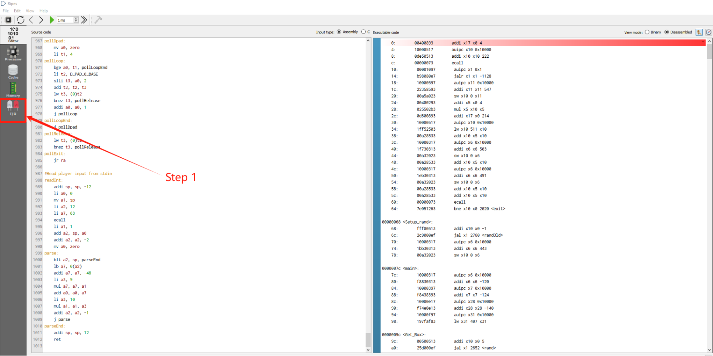
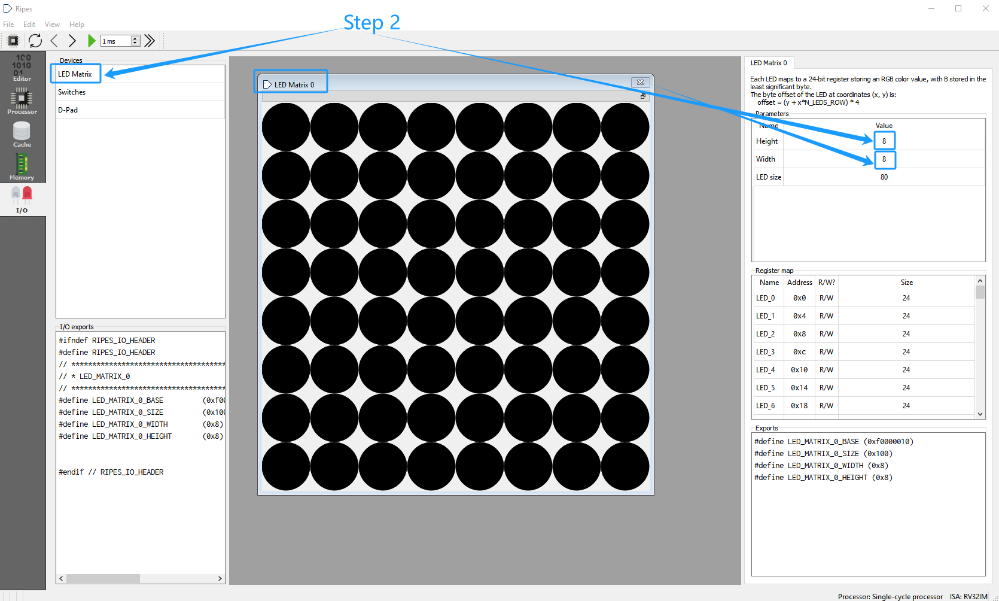
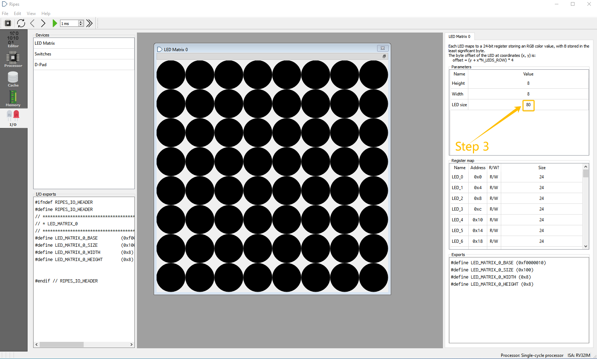
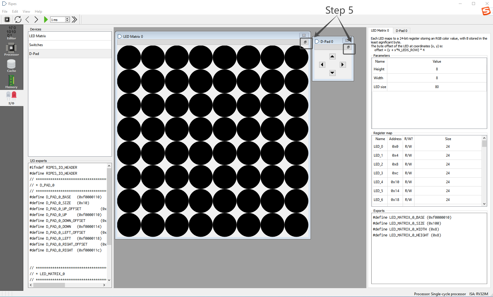
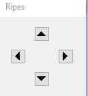
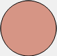
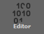

# Instruction Manual for Sokoban

Program Author: (Leon) Erlan Liang

Requirements:

*   Recommend around 1-5 Players.
*   Approximately 3-5 minutes.
*   Age 6+.

Objective

In Sokoban, players need to push the box to the target location to succeed.

In Multi-player mode, the player competes to find the shortest route to get the box to the target

Setup

To set up the game:

        1, Open Ripes, and click the “I/O” tab  on the left.

2, Double-click on the "LED Matrix" device to get an LED matrix if there is not already

    one. To the right, players should see a panel "LED Matrix 0" with parameters

    "Height", "Width", and "Size". Set the height and width to 8 and 8. 

3, Set the size to a value that makes it comfortable for players to distinguish
the LEDs.(Range)

4, Double-click on the "D-Pad" device to get a D-pad if there is not already
one. To the right, players should see a panel "D-Pad 0".

5, Single-click the window sign   under the cross sign for "LED Matrix 0" and "D-Pad 0".

Now we have successfully set up the game.

Let’s get to know the game’s components!

Components
==========

Sokoban contains the following components:

        1, A D-pad for players to control the character.

The  buttons on the D-pad correspond to the up, down, left, and right movement of the character on the LED grid, as shown below:

2,  An 8x8 LED grid that displays the game.

Different elements in the grid:

- Character  The Character is controlled by the D-pad.

- Box  The Box can only be pushed by the Character.

- Target The Target indicates the location where the box should be pushed to.

- Wall  The Wall serves as an immovable barrier that defines the play area and limits the pathways for pushing boxes to the Target.

3, A Console acts as an interface that displays the game's current status and

registers the inputs made by players.

How to Play
===========

Starting a New Game
-------------------

        1, Single-click the “Editor” tab  on the left.

        2, Single-click the fast execution tab  at the top left to run the game.

        3, Enter the number of players into the Console.

Starting a New Round
--------------------

        1, Once the player inputs the number of players, the first round will start, and the

    Console will display a message to notice the player.

        2, The Console will display messages indicating when it is each player's turn.

        3, If players solve the puzzle and succeed, the Console will display “Good Job!”

    If a play fails, the player can choose to skip the round(More detail below), the

    Console will prompt “It’s okay, do better next round!”.

4, Once every player finishes, the Console will display the result of the round and

    the cumulative scoreboard.

Description of Special Player Actions
-------------------------------------

*    Stuck? Skip!

If players maneuver the Box into an unsolvable position, they have the option to bypass the current round. To initiate this, the player can control the Character to push against any Wall, and the Console will ask the player to confirm whether they wish to skip the round.

##### If a player skips his round, his current round result will count as FAIL, and the move count for the round will be auto-set to 20.

End of a Round/Game
-------------------

*   Exit or Continue

At the end of each round, the console will ask the player to confirm whether they wish to continue to the next round.

If yes, the game will start a new round; otherwise, the game will end. At this time, the player who has the lowest Score (Least moves made) will win the game.

Things to Keep in Mind
======================

*   Only enter data into the Console when prompted.
*   If there is no response after input when requesting a skip round, please attempt to request again.
*   Please prevent entering invalid data when entering the number of players, which may cause the game to end.
*   If multiple players are in first place at the end of the game, they are all winners!
*   If the Grid LED occurs a display error, the players can set up the LEDs first(The Setup Section at the top), and reload the code by restarting the Ripes.